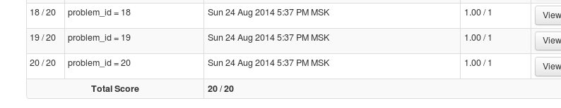

## Executive summary
Physiologists and fitness industry have done a lot, quite validly, in promoting
physical activities. However, little attention has been paid so far to question:
If physical exercises performed "correctly"? This paper focuses on the machine
learning part of answering this question and shows how to turn movement data from
sensors attached to athlete bodies to interpretable results.  
The trained model: `"C5.0"`  
Out of sample accuracy on training set: 99.6%       
Coursera accuracy on 20 sample test: 100%            

## Note on compiling this document from .Rmd

Compiling this document from scratch may take up to 10 hours, depending on computer,
due to computationally intensive 5-time 10-fold Cross-validation.
This is why I set global chunk options: `eval=FALSE`
Fully reproducible code can be found in github repo https://github.com/sbushmanov/Machine_Learning
in well commented file `run-analysis.R`

```{r setup}
library(knitr)
opts_chunk$set(eval=FALSE)
```


## Data description

The data come from 4 accelerometers attached to: belt, forearm, arm, and dumbbell.
6 individuals repeat 10 barbell lifts correctly and incorrectly under supervision
of experienced trainer. Corresponding data from accelerometers is marked:  

- "A", for correct execution  
- "B", "C", "D", "E" for 4 different ways of incorrect execution  

The ultimate aim of this machine learning exercise, as stated above, is to train
categorical regression model to differentiate among 5 states of the world. The training data set resides at https://d396qusza40orc.cloudfront.net/predmachlearn/pml-training.csv
and testing data set at https://d396qusza40orc.cloudfront.net/predmachlearn/pml-testing.csv. The progect page is http://groupware.les.inf.puc-rio.br/har.

## Reading data into R  

To facilitate working with R code and save bandwidth I only download data if it has not been downloaded yet. 
Given big size of data, the same logic applies to reading data as well:
```{r}
require(RCurl)
trainURL <- "https://d396qusza40orc.cloudfront.net/predmachlearn/pml-training.csv"
testURL <- "https://d396qusza40orc.cloudfront.net/predmachlearn/pml-testing.csv"
if (any(!file.exists("./data/train.csv") | !file.exists("./data/train.csv"))) {
        dir.create("data")
        download.file(trainURL,
                      destfile="./data/train.csv",
                      method = "curl")
        download.file(testURL,
                      destfile="./data/test.csv",
                      method = "curl")
}

if (any(!exists("train") | !exists("test"))) {
        test <- read.csv("./data/test.csv",
                         header=TRUE,
                         stringsAsFactors=F,
                         na.strings=c("", "NA", "#DIV/0!"))
        train <- read.csv("./data/train.csv",
                          header=TRUE,
                          stringsAsFactors=F,
                          na.strings=c("", "NA", "#DIV/0!"))
}
```

Note `na.strings=c("#DIV/0!")`. Without this otpion, when converting data to
numeric format, I was getting ~ 30 warnings. To find culprit's column I applied the
following trick:

```{r eval=FALSE}
options(warn=2)
for (i in seq_along(t)) {
        print(i)
        t <- as.numeric(t[i])
}
```
and found the column index where first warning originated. By visually inspecting 
contents of that column I discovered this
strange `"#DIV/0!"` string. Adding it to two other `NA` codings eliminated warnings completely.

The next step is to extract predictors from columns.
By visual inspection of column name list `colnames(test)` and comparing column
names to accelerometer locations (belt, forearm, arm, and dumbbell), my conjecture at this step is that columns not containing these words can be dropped (this conjecture
proved correct later by high Accuracy of the Final model).

```{r}
t <- train[grep("belt|forearm|arm|dumbbell|classe", colnames(train))]
te <- test[grep("belt|forearm|arm|dumbbell|problem_id", colnames(test))]
```

Next step is to convert predictors to `numeric` format and outcomes to `factors`

```{r}
t1 <- as.data.frame(sapply(t[1:152], "as.numeric"))
te1 <- as.data.frame(sapply(te[1:152], "as.numeric"))
t1$classe <- factor(t$classe)
te1$problem_id <- factor(te$problem_id)
```

Obviously, not all accelerators are equal in predicting correctness of
barbell lifts (do you have an idea what belt accelerometer was for?). An
elegant way of deciding what predictors contain most variability and decreasing number of
predictors would be to apply SVD/PCA transformation, which would address multicollinearity
as well. I have attempted brute-force by simply dropping near-zero variance
variables with the help of `caret` package:

```{r}
library(caret)
zeroVar <- nearZeroVar(t1)
t2 <- t1[, -zeroVar]
te2 <- te1[, -zeroVar]
```
As I was getting some wierd warnings while trying to get working `svmRadial` and `gbm` models, I decided to get clean names for columns, while saving
them for later use in `t2Colnames` object.

```{r}
t2Colnames <- colnames(t2)
t3 <- t2
te3 <- te2
colnames(t3)[1:117] <- as.character(1:117)
colnames(te3)[1:117] <- as.character(1:117)
```

## Training model

Training R models on an IBM laptop  may take up to several days (was thinking about switching to NVIDIA CUDA once). Fixing laptop variable, the time depends
on type of model and the way model validation is applied.

- **Type of model**. 

Max Kuhn et al in his  bestselling ["Applied Predictive Modelling"](http://www.amazon.com/Applied-Predictive-Modeling-Max-Kuhn/dp/1461468485/)
provides a breakup of categorical regression models by predictive ability,
`C5.0`, `svm`, and `gbm` being among the best.   

On my machine `gbm` never finished simple training run, `svm` produced some incomprehensible warnings so
I shelved it, and finally I decided to concentrate on `C5.0`.

- **Cross-validation**

Training model on an entire training data set will (1) overfit model (2)
provide overoptimistic estimate for out of sample accuracy. To correct for
this bias, different techniques have been suggested: k-fold Cross-validation, 
generalized Cross-validation, Monte-Carlo Cross-validation, bootstrap, and
leave-one out cross validation (k-fold Cross-validation with k set to sample size).

For this project I have chosen n-time k-fold cross validation, which may
be broken down into the following simple steps:  

  - **Step 1.** Divide training set into k non-overlapping subsets (folds)  
  - **Step 2.** Train on k-1 folds and estimate goodness of prediction on k-th (Accuracy, Kappa for
  categorical regression; MSE/RMSE, R squared for numerical regression. May be ad-hoc, if you wish.). Do the same for all k folds.  
  - **Step 3.** Repeat Steps 1 and 2 n times (to visualize what it means: imagine the data set is
  a ring, divided into k-folds/strips. After training and validating on k-folds at hand, you
  shift division along ring to obtain new set of k-folds and repeat shifting n-times)

With the help of `caret` package 5-time 10-fold Cross-validation is coded
as follows:

```{r}
ctrl <- trainControl(method = "repeatedcv",
                     repeats = 5,
                     number = 10)
```

and the final model becomes:
```{r eval=FALSE}
library(doMC)
registerDoMC(cores = 2)
c50TuneFinal <- train(x =t3[, -118],
                      y=t3[,118],
                      method = "C5.0",
                      preProc = c("center", "scale"),
                      trControl = ctrl)
```

Please note that n-repeats k-fold Cross validation is computationally intensive
procedure. 5-time 10-fold Cross validation increase computation time by ~50 times
over one simple regression fit. This is why I turn on multithreading in attempt to reduce
computation time.

Model summary:

```{r}
> c50TuneFinal
C5.0 

19622 samples
  117 predictors
    5 classes: 'A', 'B', 'C', 'D', 'E' 

Pre-processing: centered, scaled 
Resampling: Cross-Validated (10 fold, repeated 5 times) 

Summary of sample sizes: 17660, 17658, 17659, 17660, 17661, 17659, ... 

Resampling results across tuning parameters:

  model  winnow  trials  Accuracy  Kappa  Accuracy SD  Kappa SD
  rules  FALSE    1      0.971     0.963  0.00510      0.00645 
  rules  FALSE   10      0.995     0.993  0.00202      0.00255 
  rules  FALSE   20      0.996     0.995  0.00131      0.00166 
  rules   TRUE    1      0.971     0.964  0.00531      0.00672 
  rules   TRUE   10      0.995     0.994  0.00183      0.00231 
  rules   TRUE   20      0.996     0.996  0.00162      0.00205 
  tree   FALSE    1      0.967     0.959  0.00573      0.00726 
  tree   FALSE   10      0.994     0.993  0.00152      0.00192 
  tree   FALSE   20      0.996     0.995  0.00138      0.00175 
  tree    TRUE    1      0.967     0.958  0.00542      0.00685 
  tree    TRUE   10      0.994     0.992  0.00182      0.00231 
  tree    TRUE   20      0.996     0.995  0.00157      0.00198 

Accuracy was used to select the optimal model using  the largest value.
The final values used for the model were trials = 20, model = rules and winnow = TRUE. 
```

Estimated out-of-sample accuracy for Final Model as per Project assignment question is `0.996`

Model prediction:
```{r }
answers <- predict(c50TuneFinal, newdata=te3[,-118])
```


Screenshot of the Cousera 20-sample test:


The time training model took is :

```{r}
c50TuneFinal$times$everything
```

```{r eval=FALSE}
> c50TuneFinal$times$everything
     user    system   elapsed 
 9375.510    19.044 10578.738 
```


## Reproducibility
1. Github repo https://github.com/sbushmanov/Machine_Learning contains following files:  
  - `run-analysis.R` -- code to reproduce results presented in this document
  - `Project_Paper.Rmd` -- `.Rmd` source of this document
  - `Project_Paper.md`, `Project_Paper.html` -- compiled versions of this document
2. http://sbushmanov.github.io/machine_learning is the address for `gh-page` of this document


## Data credit

Velloso, E.; Bulling, A.; Gellersen, H.; Ugulino, W.; Fuks, H. Qualitative Activity Recognition of Weight Lifting Exercises. Proceedings of 4th International Conference in Cooperation with SIGCHI (Augmented Human '13) . Stuttgart, Germany: ACM SIGCHI, 2013.

Read more: http://groupware.les.inf.puc-rio.br/har#weight_lifting_exercises#ixzz3BKm9xveF